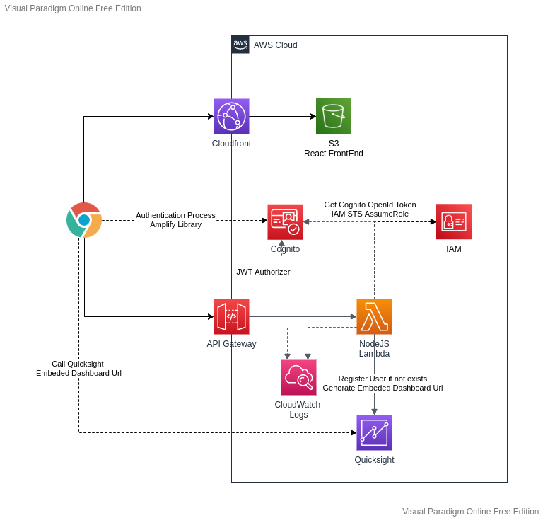

# Quicksight-Cognito

Quicksight Cognito lambda configured to display Quicksight Dashboard inside web application without Amplify black magic.

## Infrastructure



## How to deploy this infrastructure?

1. Create a Quicksight Enterprise account (this cannot be created by Cloudformation :/) 
1. Deploy Cloudformation stack with this [yaml file](./quicksight-cognito-cloudformation.yml)
1. Build webapp & lambda codes
   ```
   $ cd web && yarn install && yarn build
   $ cd ../lambda && npm install && npm run build
   ```
1. Deploy built code using [CLI](https://aws.amazon.com/fr/cli/) or manually
    1. Retrieve CI User Access Key information in CloudFormation stack output & configure your CLI to use it (`aws configure`)
    1. Execute CLI commands
    ```
    $ cd web && aws s3 cp ./build/ s3://quicksight-cognito-web-app-s3 --recursive
    $ cd ../lambda && aws lambda update-function-code --function-name quicksight-cognito-lambda --zip-file fileb://lambda.zip --publish
    ``` 
1. Configure Quicksight to allow your frontend domain url to display an embedded dashboard
    1. Retrieve your domain name in Cloudformation stack output
    1. Go to `Domains & Integration` in Quicksight and add your domain name to the list
1. Create Quicksight Dashboard & and complete Lambda `QUICKSIGHT_DASHBOARD_ID` environment variable with dashboard id 

## Environment variables used by Lambda code

- COGNITO_IDENTITY_POOL_ID (configured by Cloudformation)
- COGNITO_USER_POOL_URL (configured by Cloudformation)

- STS_ROLE_ARN_TO_ASSUME (configured by Cloudformation)

- QUICKSIGHT_REGION (configured by Cloudformation)
- QUICKSIGHT_DASHBOARD_ID (configured manually)

- AWS_ACCOUNT_ID (configured by Cloudformation)

## Documentation

* [Quicksight Developer Portal](https://www.developer.quicksight.aws/)
* [Learn Quicksight Workshops](https://learnquicksight.workshop.aws/en/dashboard-embedding.html)
* [Quicksight-Cognito with Amplify Github](https://github.com/aurbac/amplify-quicksight-dashboard-embedded)
